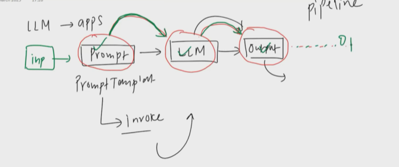

# Chains

- Bhai, LangChain mein Chains ko bilkul simple Hindi-English mix mein samjhta hoon! 😎

### Chain Kya Hai? 🤔
Chain = LangChain ka Workflow/Process

### Jaise:

- Restaurant mein: Order lena → Cooking → Serve karna = Chain
- LangChain mein: Prompt → Model → Output = Chain

## Example

- Ek ka o/p doosre ka i/p

## Types

- Simple Chain
- Sequential Chain
- Parallel Chain
- Contional Chain ( RunnableBranch((condition1,what to do if true),(cond2,'What to do if tru'),default , do when nothing mathces))