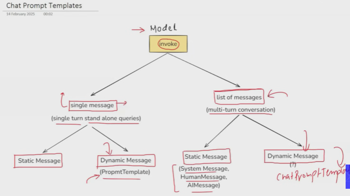

# Prompts

- Prompt are the input , instructions or query that we give the model to get an output

## Types of prompts

### 1. Static Prompts

- Ye jo normal query to llm ko bhejte ho

### 2. Dynamic Prompts

- Ismein to ek template prepare karke rakhte ho aur usmein variable inject karte ho
- Dekho bhai agar user dalega prompt to wo to kuch bhi daal sakta hai 
- Instead usse neccessary information ya varibales le lo baaki ham ek detailed prompt banaenge wo bhejna chat model ko

## Note

- Why use prompttemplate why can't we use f strings??

    - you can use f strings as well
    - But pt provides ( validation (over inputs , any extra input), tightly coupled with the langchain ecosystem, reusable)

## Simple Project ( a chatbot)

- First we created simple chatbot where we take input from user and ai gives you the answer to that prompt
- But we dont maintain any history , the AI will not be able to answer the questions related to the previous answers
- **LLMs dont remember previous chat history on their own** (it's the *application* managing the history by feeding it back to the LLM, not the LLM retaining it on its own across requests. )

- To store history
    - Hamein chat history bhejni padegi instead of a single prompt

Isse hamne chat history to maintain kar li lekin jaise jaise history badi hogi, Ai will get confused ki kisne kaunsa answer diya tha kyunki ham to aise store kar rahe

- chat_his=[which is bigger 2 or 4,**4** is bigger than 2.,can you give me the square of the bigger number?,The square of 4 is 16.,LCM of the answer,The LCM of 16 is 16.]
- Ab ismein to ye bata pana mushkil hai ki AI ne kya kaha aur user ne kya
- To hame ek dict user: says this , AI: says this aisa karke store karna hoga

- To solve this we have **messages** in Langchain

### Messages

LangChain uses several `BaseMessage` types to structure conversations with LLMs. Key types include:

*   **`HumanMessage`**: Represents input directly from a human user.
*   **`AIMessage`**: Contains the response generated by the LLM.
*   **`SystemMessage`**: Provides instructions or context to the LLM, defining its role or behavior. Usually at the starting

### MessagePlaceholder

- Dekho bhai jo hamne upar chat history banaiyi wo to ek sesssion ki hai na
- Agar program re run hoga to wo history gayab
- To hame kahin par to store rakhna padega the history taaki baad mein same jagah se context utha ke ai baat kar sake
- Jaise zomato chabtot ko yaad rahta hai pichle conversations
- So in our case ham txt file mein history store karenge ideally to db mein hota hai but ismien yahin kar rhe

`MessagePlaceholder` in Langchain is like a blank slot in your conversation chain, reserved for a *list of chat messages* you'll provide later.

Instead of writing out exact messages when you define your chain, you use `MessagePlaceholder(variable_name='history')`. This tells Langchain: "When this chain runs, expect a list of previous chat messages (like user questions and AI answers) under the key `history` to be inserted here."

It's essential for building flexible conversational AI, allowing you to dynamically inject the ongoing chat history or new user input into your prompts without predefining every message.

