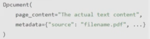

# RAG Components

RAG ka pata to hai na bhai :)

## Document Loaders

- Document Loaders are components in LC used to load data from various sources into a standardized format , which can be further used for processing
- Document Loaders are components in LangChain that help you load data from various sources and convert them into Document objects that can be processed by LangChain pipelines.
- Main point is Ki source kuch bhi ho lekin usko langchain convert kardega in *`Document object`* format
- Hamesha ek list of document aega in this object

## 1. Text Loaders

- Text ko convert karta hai document object mein

## 2. PyPDF Loader

- PDF to document object
- For each page it will create a document object

|   Loader |    Best For    |
|----------|-----------------|
|PyPDFLoader	|	Simple PDFs, Fast processing
|PDFPlumberLoader|		High accuracy, Tables, Academic papers
|UnstructuredPDFLoader|		Complex layouts, Scanned PDFs, OCR
|PyMuPDFLoader		|Large PDFs, Performance critical

## 3. DirectoryLoader

- Load an entire directory of content

### Load vs LazyLoad

|load()|lazy_load|
|-----|---|
|Eager Loading (loads everything at once). |Lazy Loading (loads on demand).
|Returns: A list of Document objects.|Returns: A generator of Document objects.
|• Loads all documents immediately into memory.|Documents are not all loaded at once; they're fetched one at a time as needed.
| Best when:    |   Best when:
|• The number of documents is small.|• You're dealing with large documents or lots of files.
|• You want everything loaded upfront.|• You want to stream processing (eg, chunking, embedding) without using lots of memory.
|Synchronous - Blocks until all data loaded	|Asynchronous-friendly - Can be used in streaming

## 4. Web Based Loader

- Extract content from web pages ( URLs)
- It uses BeautifulSoup under the hood to parse HTML and extract visible text
- Works best for static pages

## 5. CSV Loader

- CSV to Document object
- Each row is a document

## Custom Loader can also be created