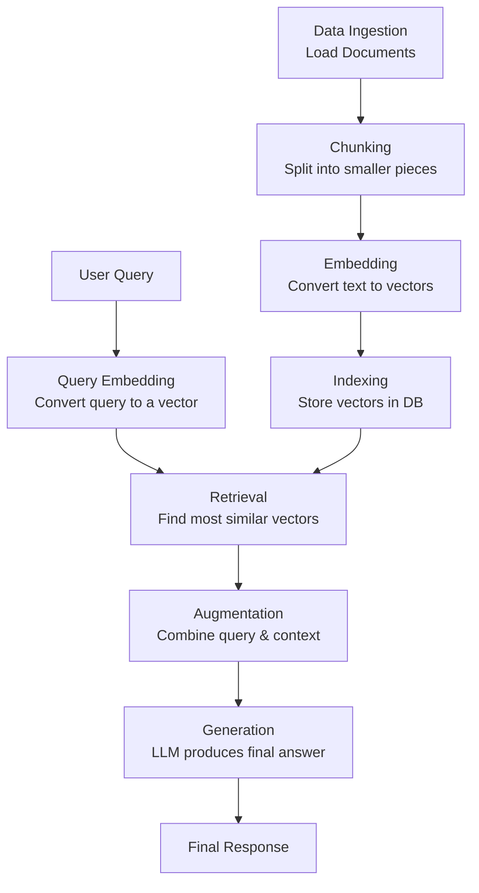

### What is RAG?

Retrieval-Augmented Generation (RAG) is an AI framework designed to improve the quality and reliability of Large Language Model (LLM) responses by grounding them in external, authoritative knowledge sources.

In simple terms, it's like giving an LLM the ability to "look up" information in a reference library before answering a question, rather than relying solely on its internal, static training data.

* * * * *

### The Core Problem RAG Solves

Standard LLMs, despite being powerful, have key limitations:

1.  Static Knowledge: Their knowledge is frozen at the point of their last training. They are unaware of recent events, proprietary data, or specific internal documents.

2.  Hallucinations: They can generate plausible-sounding but incorrect or fabricated information.

3.  Lack of Source Attribution: It's difficult to verify where the model's information came from, making it untrustworthy for critical applications.

4.  Outdated Information: They cannot provide answers about events that occurred after their training cut-off date.

RAG directly addresses these issues by dynamically retrieving relevant, up-to-date information and using it as the foundation for the answer.

* * * * *

### Core Components of a RAG System

A RAG pipeline can be broken down into three main interconnected components:

#### 1\. Retriever

This component is responsible for finding the most relevant information from a knowledge base in response to a user's query.

-   Knowledge Base (Vector Database): This is not just a simple database; it's typically a vector database (e.g., Pinecone, Weaviate, Chroma) that stores the external data. This data can be company documents, product manuals, recent news articles, code documentation, etc.

-   Embedding Model: This is the engine that converts text into numerical representations called vector embeddings. These embeddings capture the semantic meaning of the text. Sentences with similar meanings will have similar vector representations.

-   Indexing Process (The "Prep Work"): Before any queries can be made, the raw data must be preprocessed and loaded into the knowledge base. This involves:

    -   Loading: Ingesting data from various sources (PDFs, Word docs, websites, etc.).

    -   Splitting/Chunking: Breaking down long documents into smaller, manageable chunks. This is crucial for retrieving precise information.

    -   Embedding: Converting each text chunk into a vector using the Embedding Model.

    -   Storing: Saving these vectors and their corresponding original text (metadata) in the Vector Database.

Analogy: The Retriever is the librarian and the card catalog system. The indexing process is like cataloging all the books in the library, and the vector database is the organized catalog itself.

#### 2\. Generator

This is the Large Language Model (e.g., GPT-4, Llama 3, Claude) that produces the final, natural language answer.

-   Augmented Prompt: The Generator doesn't work with just the user's original query. It receives an augmented prompt that combines:

    1.  The original user query.

    2.  The most relevant text chunks (context) retrieved by the Retriever.

    3.  Instructions on how to formulate the answer (e.g., "Answer based only on the provided context.").

-   Synthesis Task: The LLM's job is to synthesize the retrieved context and the user's query to generate a coherent, accurate, and well-structured answer. It "grounds" its response in the provided evidence.

Analogy: The Generator is the expert orator who takes the notes gathered by the librarian and weaves them into a clear, eloquent, and direct answer for the patron.

#### 3\. The Augmentation Interface / Orchestrator

This is the "glue" that connects the Retriever and the Generator. It's the logic that manages the entire workflow. In modern frameworks, this is often handled by tools like LangChain or LlamaIndex.

-   Query Handling: It takes the user's query and initiates the retrieval process.

-   Prompt Engineering: It constructs the final, augmented prompt that is sent to the Generator, ensuring the context and instructions are properly formatted.

* * * * *

### The RAG Workflow Step-by-Step

The following diagram illustrates the complete RAG process, from data preparation to final response:

Here is a detailed explanation of each step shown in the diagram:

Indexing Phase (Preparatory, happens once or periodically):

1.  Data Ingestion & Chunking: The raw documents are loaded and split into smaller chunks. This is critical for precision.

2.  Embedding: An embedding model converts each text chunk into a vector.

3.  Indexing: These vectors are stored in a vector database, creating the searchable knowledge base.

Retrieval & Generation Phase (Happens for every query):

1.  Query Embedding: When a user submits a query, the same embedding model converts the query into a vector.

2.  Retrieval: The system performs a "similarity search" in the vector database to find the stored vectors (text chunks) that are most semantically similar to the query vector. It retrieves the top `k` most relevant chunks.

3.  Augmentation: The original user query and the retrieved context chunks are combined into a structured prompt.

4.  Generation: This augmented prompt is sent to the LLM (Generator). The LLM synthesizes the information and generates a final, human-readable answer that is grounded in the provided context.

5.  Response: The final answer is delivered to the user, often with an option to cite the source documents.

* * * * *

### Why is RAG So Important? Key Benefits

-   Accuracy & Reduced Hallucinations: By constraining the LLM to use specific source material, RAG drastically reduces the chance of making things up.

-   Up-to-Date Information: The knowledge base can be updated anytime, allowing the system to access current information without expensive model retraining.

-   Cost-Effective: It's significantly cheaper to update a vector database than to continuously retrain a massive LLM.

-   Trust and Transparency: Responses can be linked back to their source documents (citations), allowing users to verify the information. This builds trust.

-   Handles Proprietary Data: Companies can build powerful QA systems on their private documentation, wikis, and databases without leaking sensitive data to public models.

* * * * *

### Advanced RAG Techniques

As the field has evolved, more sophisticated RAG systems have emerged to tackle challenges like incomplete retrieval or poor context quality:

-   Hybrid Search: Combines traditional keyword-based search (BM25) with vector search for better recall.

-   Query Transformation / Expansion: Rewrites or expands the user query for better retrieval (e.g., using "step-back prompting" to find more general concepts first).

-   Re-Ranking: After the initial retrieval, a smaller, more powerful model re-ranks the chunks to select the absolute best ones for the generator.

-   Fine-Tuning: The embedding model or the generator LLM can be fine-tuned on domain-specific data to improve performance for specialized tasks.

In summary, RAG is a powerful and essential framework for building reliable, accurate, and trustworthy LLM applications, moving beyond the limitations of raw LLMs by connecting them dynamically to external knowledge.

