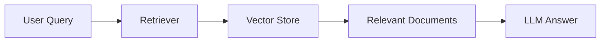

# Retrievers


---

## 📘 What is a Retriever?

**Retriever** ek aisa component hota hai jo  
LLM (Large Language Model) ke liye **relevant information fetch** karta hai —  
from your **Vector Store**, **database**, ya **API**.

- (query) => Retriever => (document objects)
- **Note** -> All retrievers are runnables in langchain

> 💡 Simple words mein: Retriever = “Data fetcher” for your AI model.

LLM ko sab kuch yaad nahi hota —  
isliye retriever usko **context** provide karta hai  
taaki wo **accurate aur grounded answers** de sake.

---

## 🧩 Retriever ka role RAG (Retrieval-Augmented Generation) mein

```mermaid
graph LR
A[User Query] --> B[Retriever]
B --> C[Relevant Documents]
C --> D[LLM (Generates Final Answer)]
Retrievers help karte hain LLM ko real-world ya private data se
“contextual knowledge” dene mein.
```

## ⚙️ How Retrievers Work (Step-by-Step)
User Query →
Tum input dete ho, jaise: "Tell me about Rohit Sharma’s IPL career"

Query Embedding →
Retriever query ko vector (embedding) mein convert karta hai.

Search Vector Store →
Ye vector store mein similar embeddings (meaning-based) search karta hai.

Retrieve Top Documents →
Wo sabse relevant documents (say, top 3 or 5) nikalta hai.

Send to LLM →
Ye documents LLM ko context ke form mein diye jaate hain,
taaki answer meaningful aur factual ho.

🧠 Retriever vs Vector Store — Kya Difference Hai?
--

|Concept	|Role|
|--|--|
Vector Store|	Stores embeddings and supports search
Retriever	|Interface that tells how to search and what to return
LLM	|Uses retrieved data to generate answers


So, retriever is like a bridge between your Vector Store and the LLM.

⚙️ Common Retriever Types in LangChain
--
|Retriever Type	|Description|
|--|--|
VectorStoreRetriever|	Uses similarity search on stored embeddings
MultiQueryRetriever	|Expands query into multiple versions for better recall
ContextualCompressionRetriever|	Compresses context (summarizes before passing to LLM)
ParentDocumentRetriever|	Retrieves parent doc when only chunk matched
TimeWeightedVectorStoreRetriever|	Gives recent documents more importance
SelfQueryRetriever|	Uses LLM itself to generate better search queries
BM25Retriever|	Traditional keyword-based search retriever

# Different types of retrivers

### Wikipedia Retrievers

- Wikipedia API se searched query ka content fetch karta hai ( with some search logic)
- Ek doubt ye to document loader jaise ni lag rha??
- Ki bas data hi to la rha hai
- Ni bhai wo peeche kuch search logic hai wo use karta hai aur relevant data hi deta hai

### Vector Store Retriver

- **VectorStoreRetriever** ek aisa retriever hai jo  
directly **Vector Store (like FAISS, Chroma, Pinecone, etc.)** se  
**meaning-based (semantic)** search karta hai 🔍 

> 💡 Simple words mein:  
> Ye ek “wrapper” hai jo Vector Store ko retriever ke form mein use karne deta hai.

---

## 🧩 Why is it needed?

LangChain mein LLMs directly vector stores se baat nahi karte.  
LLM → Retriever → Vector Store ka chain hota hai 👇



### Why use retriver when we can directly get the document from vector_store.get functions??

- See that function is very limited depending upon the store and works in a certain way
- But with retrievers we can try out retrievers with different seach mechanism and get the best result

### 4. MMR

## ❓ What is MMR?

**MMR (Max Marginal Relevance)** ek retrieval strategy hoti hai  
jo **relevance + diversity** dono ko balance karti hai.

> ✅ Relevant documents leke aata hai  
> ✅ Par ensure karta hai ki results `similar-similar` repeat na ho

Matlab sirf **closest (semantic similar)** docs nahi deta,  
balki **variety** bhi rakhta.

---

## 🧠 Why MMR is Needed?

Normal similarity search mein problem hoti hai:

> Har result ek-dusre jaisa hi hota hai 😐

Example:
Query: `“Virat Kohli IPL career”`

Normal search may return:

1. Virat Kohli scored 7000 IPL runs  
2. Virat Kohli scored most runs for RCB  
3. Virat Kohli is top IPL player

Sab almost same baat repeat ho rahi hai ❌

**MMR will try to give:**

1. Virat Kohli scored 7000 IPL runs ✅ (relevant)
2. RCB captain Virat Kohli led for 8 years ✅ (diverse)
3. Virat Kohli won Orange Cap in 2016 ✅ (different angle)

---

## 💡 Simple Analogy

Normal search =  
> “Sab se similar results lao”

MMR =  
> “Relevant results lao — **but har ek alag perspective ke saath**”

---

## ⚙️ Formula (Conceptual)

MMR considers 2 things:

- **Similarity(query, document)** → kitna relevant hai
- **Dissimilarity(doc1, doc2)** → kitna unique hai

It maximizes:

- `λ (lambda)` controls balance  
  - Higher λ → more relevance
  - Lower λ → more diversity

---

## 🧾 LangChain Code Example

```python
retriever = vector_store.as_retriever(
    search_type="mmr",
    search_kwargs={"k": 3, "lambda_mult": 8}
)

docs = retriever.get_relevant_documents("Virat Kohli IPL career")

for d in docs:
    print(d.page_content)
```


### 5. Multi Query Retriver

---

## 💭 Motivation — Problem kya hai?

Kabhi kabhi hum ek **query likhte hain**,  
aur uska matlab model ke hisaab se **thoda vague ya limited** hota hai.

Example query:  
> “Virat Kohli IPL performance”

Ab is query ke bahut saare possible meanings ho sakte hain:
- “Virat Kohli’s batting stats in IPL” 
- “Virat Kohli’s captaincy in IPL” 
- “Virat Kohli’s records and achievements” 
- “Virat Kohli’s 2016 IPL season”

Agar hum simple retriever use karein,  
wo sirf **ek embedding** banata hai aur uske aaspaas ke documents fetch karta hai.  
Result? — Sirf ek **angle** milta hai (baaki chhoot jaate hain 😕)

---

## 🚀 Solution — MultiQueryRetriever

**MultiQueryRetriever** kaam karta hai **LLM se multiple reformulated queries** banwa ke,  
aur un sab queries ke results combine karta hai ✅

> 💡 Simple words mein:  
> Ye tumhare ek query ko **multiple perspectives** me todta hai  
> aur sabka combined best result deta hai.

---

## ⚙️ How It Works (Step-by-Step)

```mermaid
graph LR
A[User Query] --> B[LLM Rewrites Query into Multiple Versions]
B --> C[Each Query → Vector Store Search]
C --> D[Combine All Retrieved Documents]
D --> E[Final Merged Diverse Set of Results]
🧩 Example Use Case
Query: “Virat Kohli IPL performance”
```

LLM generates:

- “Virat Kohli batting record in IPL”
- “How has Virat Kohli performed as a captain in IPL?”
- “Virat Kohli’s achievements during the 2016 IPL season”
- Retriever searches for all 3 queries → merges results → gives diverse and comprehensive info 🎯


## 5. Contexual Compression Retriver

### 💭 Problem: Normal Retrievers Bring Too Much Data

Normal retrievers (like `VectorStoreRetriever`) retrieve full documents or chunks,  
even if only **a small part** is relevant to your query 😕

Example:
> Query → "How many runs did Virat Kohli score in IPL 2016?"

Retriever might bring:
Virat Kohli is an Indian cricketer...
He plays for RCB...
In IPL 2016, he scored 973 runs...
He also led RCB to the finals...

```yaml
Copy code

⚠️ Issue → Only **“973 runs”** was relevant; rest is noise.  
This extra context:
- Increases **token usage** 💰  
- Confuses LLM 😵  
- Slows down your system ⚙️
```
---

## 🚀 Solution: Contextual Compression Retriever

**ContextualCompressionRetriever** fixes this by:
> “Compressing” or “summarizing” documents before sending them to LLM.

It uses another **compressor component** (usually an LLM or filter)  
to **shrink irrelevant parts** and keep only the **core, query-related content** 🧠  

---

## ⚙️ How It Works (Step-by-Step)

```mermaid
graph LR
A[User Query] --> B[Base Retriever (e.g., FAISS)]
B --> C[Relevant Documents]
C --> D[Compressor (LLM-based filter/summarizer)]
D --> E[Short, Focused Context]
E --> F[LLM Generates Final Answer]
🧩 Example in LangChain
```


### 🧠 What Happens Internally
- Base retriever → fetches top relevant documents
- Compressor (LLM) → reads those docs + query
- It extracts only the relevant sentences or info
- Returns short, to-the-point content to your main LLM