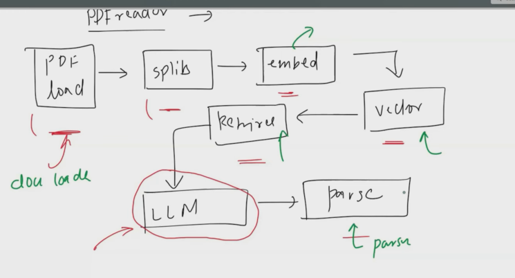

# Runnables

## Why runnables? ( Back story )

- In 2022, Langchain ki team ne ye identify kiya ki over the time LLM based application aur bhadenge
- To kyun na ham ek aisa *`framework`* bana dein jo AI developers ko help kar sake
- General Kaam kya hai ek input do LLM ko aur wo output dega
- Lekin LLMs to bahut sare honge sabki alag class likho baith ke
- Langchain walo ne identify kiya aur minimal code changes ke saath sare llms ke liye ek class bana di
- Ab lekin ek AI workflow main sirf yahi ni hota hai aur bhi cheezein hoti hai jaise



- PDF reader ( pdf load -> split => embed -> vectors -> retriever -> LLMs -> parser)
- To unne in sab ke liye bhi ek ek *`component`* bana diya jisse AI developers ko aur assani ho gayi
- Further unhone kuch common flows notice kiya jaise har LLM app mein tum input loge aur use LLM ko bhejoge to unhone isko abstract karne ke liye LLMChain karke function bana diya
- Similarly RAG ke liye ek function bana diye jo sirf llm lega aur retriever aur tumhare query ka answer kar dega
- Aisa karke unne bahut sare chains bana diye

### The Problems

- Itne sare chains bana diye ki dikkat ane lagi
    - Codebase bada ho gyaa
    - nae AI engineers ko samajh hi ni a rha tha ki kaunsi chain ka use case kya hai

```python

# LangChain Chains: Kya Hua? 🤔

## Initial Idea Achcha Tha

Shuru mein, kuch basic chains thay jo bahut useful thay:

LLMChain()          # Basic LLM call
RetrievalQA()       # Simple RAG
ConversationChain() # Chat history
```

Simple, clean, aur easy to understand!

---

## Par Phir Ye Ho Gaya... 😵

Itne sare chains ban gaye ki confusion ho gaya:
```python
AnalyzeDocumentChain()
APIChain()
ChatVectorDBChain() 
ConversationalRetrievalChain()
GraphQAChain()
HypotheticalDocumentEmbeddingChain()
LLMCheckerChain()
LLMMathChain()
LLMRequestsChain()
MapReduceChain()
MultiPromptChain()
MultiRetrievalQAChain()
OpenAIModerationChain()
QAGenerationChain()
RetrievalQAWithSourcesChain()
SQLDatabaseChain()
VectorDBQAChain()
# ... aur bhi kayi!
```

---

## Problems Kyun Aaye? 🚨

### 1. Codebase Ka Bhoot Bada Ho Gaya
```python
# Naya engineer sochta hai:
# "Mujhe RAG chain chahiye... lekin kaunsi?"
from langchain.chains import (
    RetrievalQA,
    RetrievalQAWithSourcesChain, 
    VectorDBQAChain,
    ConversationalRetrievalChain,
    MultiRetrievalQAChain
)

# 🤯 Kaunsi chain use karun? Sab similar lag rahi hain!
```

### 2. Documentation Hell 📚

- Har chain ka alag documentation
- Har chain ke alag parameters
- Har chain ka alag output format
- Consistency zero!

### 3. Learning Curve Bahut Steep 📈
```python
# Naya developer confusion mein:
chain1 = RetrievalQA.from_llm(llm, retriever)  # Simple
chain2 = ConversationalRetrievalChain.from_llm(llm, retriever)  # Complex
chain3 = VectorDBQAChain.from_llm(llm, vectorstore)  # Similar but different

# Inme kya difference hai? Kaunsi kab use karein?
```

### 4. Maintenance Nightmare 🔧
```python
# Har chain update alag se
# Bug fixes alag alag
# New features implement karna mushkil
```

---

### Conclusion

- Too many chains → Too much confusion → Developer experience kharab!
- Seamlessly connect ni ho rhe the components
- Koi fix structuer ni tha koi format() use kar rha koi predict() 
- Yani koi *`consistency`* ni rahi

Pehle, har component alag-tarike se work karta tha:

```python
# OLD WAY - Inconsistent interfaces
prompt_template.format(text=user_input)  # .format() use karta hai
llm_model.generate(prompt=prompt)        # .generate() use karta hai  
output_parser.parse(response)            # .parse() use karta hai

# Har component ka alag method - confusing!
Solution - Runnables:
Ab sab components ek hi tarike se work karte hain:

python
# NEW WAY - Consistent interface
prompt_template.invoke(user_input)    # Sab .invoke() use karte hain
llm_model.invoke(prompt)              # Same method
output_parser.invoke(response)        # Same method

# Uniform interface - easy to use!
```

## The what?

Runnable LangChain ka basic building block hai. Sochiye jaise ek "worker" ya "karigar" jo:

- Input leta hai (raw material)
- Kuch processing karta hai (kaam karta hai)
- Output deta hai (final product)
- Basic Structure of ANY Runnable (input → [ RUNNABLE ] → output)

## Points to note in a runnable

- Unit of work ( can do input, do some process and give output)
- Common interface throughout
    - invoke()
    - batch()
    - stream()
- *`Each and Every runnable can be connected with each other and these connected components are itseld is a runnable`*

- A perfect analogy is Lego blocks

## Please go through the Runnables from scratch code ( if not able to understand watch the video again its very good)


# LangChain Runnables: Scratch Se Samjho! 🚀

## Case 1: Old Approach - Har Use Case Ka Ek Chain Component

### Problem: Inconsistent Methods

Pehle har class ka apna method tha - kisi ka `predict()`, kisi ka `format()`, kisi ka `run()`. Bahut confusing!

```python
import random

# Nakli LLM class (which behaves like LLM)
class NakliLLM:
    def __init__(self):
        print("LLM created")
    
    def predict(self, prompt):
        response_list = [
            'first res',
            'second res',
            'third res'
        ]
        return {'response': random.choice(response_list)}

# Nakli PromptTemplate class (which behaves like PromptTemplate)
class NakliPromptTemplate:
    def __init__(self, template, input_variables):
        self.template = template
        self.input_variables = input_variables
    
    def format(self, input_dict):
        return self.template.format(**input_dict)
    
    # Template kaise kaam karta hai?
    # 'hello {}'.format('Areeb') -> 'hello Areeb'
    # Dictionary ke case mein:
    # dict = {'name': 'Areeb'}
    # 'hello {name}'.format(**dict) => 'hello Areeb'
    
    # Example:
    # person = {'name': 'Bob', 'age': 25}
    # text = "Hello {name}, you are {age} years old".format(**person)
    # Output: Hello Bob, you are 25 years old

class NakliLLMChain:
    def __init__(self, prompt, llm):
        self.llm = llm
        self.prompt = prompt
    
    def run(self, input_dict):
        final_prompt = self.prompt.format(input_dict)
        result = self.llm.predict(final_prompt)
        return result['response']

# Usage
template = NakliPromptTemplate(
    'Give me a summary on this topic \n {topic}',
    input_variables=['topic']
)

# Get the prompt
prompt = template.format({'topic': 'AI'})

# Create LLM
llm = NakliLLM()

# Pass this prompt to LLM
res = llm.predict(prompt=prompt)
print(res)

# Or using Chain concept
chain = NakliLLMChain(template, llm)
print(chain.run({'topic': 'AI'}))
```

### Problem Kya Thi?

Ye to bahut complex ho gaya! 😵

- Kitni sari classes banani padegi
- Har class ka alag method: kisi ka `invoke`, kisi ka `predict`, kisi ka `format`
- **Consistency hi nahi hai!**

### Solution Kya Hai?

**Consistency kaise aayegi?** 🤔

**Hint:** OOPS concept? 

**Answer:** Sahi kaha! **Abstraction** se aayegi!

Main agar ek **abstract class** bana doon aur sabhi generic classes usse derive ho, to ek common function to sabko banana hoga! ✅

---

## Case 2: New Approach - Runnable Pattern (LCEL)

### Step 1: Abstract Base Class Banao

```python
from abc import ABC, abstractmethod

class Runnable(ABC):
    @abstractmethod
    def invoke(self, input_data):
        pass
```

### Step 2: Sab Classes Ko Runnable Se Derive Karo

#### Nakli LLM Class

```python
class NakliLLM(Runnable):
    def __init__(self):
        print("LLM created")
    
    def invoke(self, prompt):
        response_list = [
            'first res',
            'second res',
            'third res'
        ]
        return {'response': random.choice(response_list)}
    
    # ⚠️ Inform user that this predict method will deprecate
    def predict(self, prompt):
        response_list = [
            'first res',
            'second res',
            'third res'
        ]
        return {'response': random.choice(response_list)}
```

#### Nakli PromptTemplate Class

```python
class NakliPromptTemplate(Runnable):
    def __init__(self, template, input_variables):
        self.template = template
        self.input_variables = input_variables
    
    def invoke(self, input_dict):
        return self.template.format(**input_dict)
    
    # ⚠️ Inform user that this format method will deprecate
    def format(self, input_dict):
        return self.template.format(**input_dict)
```

**AB kya hua?** Ek common method `invoke()` to aa gaya bhai! 🎉

---

### Step 3: RunnableConnector Banao (Chain Components Ko Connect Karne Ke Liye)

```python
class RunnableConnector(Runnable):
    def __init__(self, runnable_list):
        self.runnable_list = runnable_list
    
    def invoke(self, input_data):
        # Yahan dekho kya ho raha hai:
        # Run chala (with an input) -> gets an output
        # Ab wo doosre ka input banega na
        # To kya karoge? -> input_data variable mein output store karlo
        
        for runnable in self.runnable_list:
            input_data = runnable.invoke(input_data)
        
        return input_data
```

---

### Step 4: Simple Chain Banao

```python
template = NakliPromptTemplate(
    'Give me a summary on this topic \n {topic}',
    input_variables=['topic']
)

# Create LLM
llm = NakliLLM()

# Let's say ek parser bhi chahiye
# Instead of this output {'response': 'second res'}
# I want just the value

class NakliStrOpParser(Runnable):
    def invoke(self, input):
        return input['response']

parser = NakliStrOpParser()

# Create chain
chain = RunnableConnector([template, llm, parser])

# Run chain
res = chain.invoke({'topic': 'AI'})
print(res)
```

**🎊 Congo! You created Runnables from scratch!**

---

## Practice: Two Chains Combined Together 🔗

**Use Case:**
1. Ek chain topic pe summary generate karti hai
2. Doosri us summary ki QnA karti hai

```python
# Chain 1: Summary Generator
template1 = NakliPromptTemplate(
    'Give me a summary on this topic \n {topic}',
    input_variables=['topic']
)

llm1 = NakliLLM()

chain1 = RunnableConnector([template1, llm1])

# Chain 2: QnA Generator
template2 = NakliPromptTemplate(
    'Give me a qna on this text \n {response}',
    input_variables=['response']
)

llm2 = NakliLLM()

chain2 = RunnableConnector([template2, llm2])

# Final Combined Chain
finalChain = RunnableConnector([chain1, chain2])

# Run the final chain
print(finalChain.invoke({'topic': "Hello"}))
```

**🎊 Congo! You built this too!**

---

## Key Takeaways 🎯

| Old Approach | New Approach (Runnable) |
|-------------|------------------------|
| Har class ka alag method | Sabka same method: `invoke()` |
| `predict()`, `format()`, `run()` | Sab ka `invoke()` |
| Inconsistent interface | Consistent interface |
| Chain banana complex | Chain banana simple |
| Components connect karna difficult | `RunnableConnector` se easy |

---

## Runnable Pattern Ke Benefits ✨

1. **Consistency:** Har component ka same interface
2. **Composability:** Easily chain together kar sakte ho
3. **Simplicity:** Ek hi method yaad rakhna hai - `invoke()`
4. **Flexibility:** Koi bhi component add kar sakte ho
5. **Maintainability:** Code maintain karna easy ho gaya

---

## Real LangChain Mein Kaise Hota Hai? 🔍

```python
from langchain_core.runnables import Runnable, RunnablePassthrough
from langchain_core.prompts import PromptTemplate
from langchain_openai import ChatOpenAI
from langchain_core.output_parsers import StrOutputParser

# Sab Runnable inherit karte hain
prompt = PromptTemplate(...)  # Runnable
llm = ChatOpenAI(...)         # Runnable
parser = StrOutputParser()    # Runnable

# Chain banana (LCEL syntax)
chain = prompt | llm | parser

# Run karna
result = chain.invoke({"topic": "AI"})
```

**Same concept hai jo humne banaya! Bas syntax thoda different hai** (`|` operator use karte hain) 😊


---

## Conclusion 🏁

Runnable pattern se:
- Code clean ho gaya
- Components reusable ban gaye
- Chains easily compose ho sakte hain
- Maintenance easy ho gayi


## Types of Runnables

### 1. Task Specific Runnables

- Khaas AI tasks ke liye bane hain
- Ready-to-use components jo specific kaam karte hain
- Jaise:

    - Chat Models (GPT, Gemini, etc.)
    - Prompt Templates
    - Output Parsers
    - Document Loaders

- Hamare custom runnable mein jo nakli wali classes banai thi wo task specific runnables hai

Examples:
```python
# Chat Model (Task Specific)
from langchain_community.chat_models import ChatOpenAI
chat_model = ChatOpenAI(model="gpt-3.5-turbo")

# Prompt Template (Task Specific)
from langchain_core.prompts import ChatPromptTemplate
prompt = ChatPromptTemplate.from_template("Tell me about {topic}")

# Output Parser (Task Specific)
from langchain_core.output_parsers import StrOutputParser
parser = StrOutputParser()
```


### 2. Runnable Primitives

- Basic operations ke liye
- Chain banane ke building blocks
- Jaise:

    - RunnableLambda (Custom functions ke liye)
    - RunnableParallel (Parallel execution ke liye)
    - RunnableMap (Data transform karne ke liye)

- Hamare custom code mein jo RunnableConnector banaya hai wo hai ye

Examples:
```python
from langchain_core.runnables import RunnableLambda, RunnableParallel

# RunnableLambda (Primitive) - Custom function
def add_prefix(text):
    return "AI: " + text

runnable_lambda = RunnableLambda(add_prefix)

# RunnableParallel (Primitive) - Multiple tasks ek saath
parallel_runnable = RunnableParallel({
    'joke': chat_model,
    'length': RunnableLambda(lambda x: len(x))
})
```

## Runnable Primitives in Langchain

### 1. RunnableSequence

- This is a sequential chain of runnables in LC that executes each step one after another, passing output of one step as the input to the other ( RunnableConnector jo banaya tha wahi hai ye)

### 2. RunnableParallel

- Name se hi samjh a rha ki parallel task ho aur fir saath mein connect ho end mein


### 3. RunnablePassthrough

- Its a special primitive that simply returns the input as output without modifying it
- Whats the use then? 
    - Original data ko persist karne ke liye
    - Jaise manlo ek chain mein 10 runnables hai
    - Ek ak ip doosre ka op ban gya 
    - Lekin man lo tumhare 5th runnable ke baad wale ka output bhi kahin print karana hai
    - Agar poori chain execute hogi to sirf last wala output hi aega
    - Is kaam ke liye we can use this 

    - Aur dhyan do to jo upar ek joke generate karke explanation wali chain banayi hai
    - Usmein joke kya tha pata karna ho to ??
    - Yes , then we use this RunnablePrimitive


### 4. RunnableLambda

- RunnableLambda is a runnable primitive that allows you to apply custom Python Functions within an AI pipeline
- It acts as a middleware between different AI components , enabling preprocessing, transformation, API calls, filtering and post processing in a Langchain workflow
- Basically Ek LLM workflow mein python code insert kar sakte ( is primitive se python function ko runnables bana sakte hai)

### 5. RunnableBranch


- Ye ek "if-else" statement ki tarah kaam karta hai
- Condition ke hisaab se different paths mein data route karta hai
- Multiple branches mein se ek ko choose karta hai

- Syntax:

```python
RunnableBranch(
    (condition1, branch1_chain),
    (condition2, branch2_chain),
    ...
    default_chain
)
```


# LCEL ( LangChain Expression Language )

- Since RunnableSequence is used everywhere
- To unne syntax change kar diya with `| (pipe)` operator
- *`Instead of RunnableSequence(sq1,sq2,sq3...) use sq1 | sq2 | sq3`*