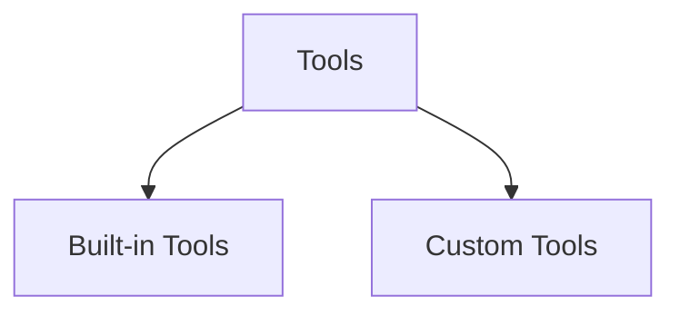

# Tools

## What is a tool?

- A tool is just a function ( or API) that is packaged in a way the LLM can understand and call when needed

- LLMs are great at:
    - Reasoning
    - Language Generation

- But they can't do things like:
    - Access live data
    - Do complex maths
    - Call APIs
    - Run code
    - Book tickets
    - Interact with a database


## Types of Tools



### a. Built-in Tools

- Built-in tools in LangChain are pre-built integrations that allow LLMs to interact with external systems, APIs, and data sources without requiring custom development.

### LangChain Built-in Tools Reference
----------------------------------

| Tool Category | Description | Class Names |
| --- | --- | --- |
| Search Tools | Connect to search engines and information sources | `GoogleSearchRun`, `GoogleSearchResults`, `DuckDuckGoSearchRun`, `WikipediaQueryRun`, `BingSearchRun`, `SerpAPIWrapper` |
| File System Tools | Read, write, and manage files and directories | `ReadFileTool`, `WriteFileTool`, `ListDirectoryTool`, `FileSearchTool`, `CopyFileTool`, `MoveFileTool`, `DeleteFileTool` |
| Database Tools | Execute queries on SQL and NoSQL databases | `QuerySQLTool`, `InfoSQLTool`, `ListSQLTool`, `QuerySQLDatabaseTool` |
| API Tools | Make HTTP requests to external APIs | `BaseRequestsTool`, `RequestsGetTool`, `RequestsPostTool`, `APIOperationTool` |
| Code Execution Tools | Execute Python code, shell commands, or other languages | `PythonREPLTool`, `ShellTool`, `BashTool` |
| Mathematical Tools | Perform calculations and symbolic math | `Calculator`, `NumExprTool`, `WolframAlphaQueryRun` |
| Web Scraping Tools | Extract and process content from web pages | `ScrapeWebsiteTool`, `WebpageQATool`, `ExtractHyperlinksTool` |
| Memory Tools | Store and retrieve information from memory systems | `VectorStoreQATool`, `VectorStoreQAWithSourcesTool` |
| Vector Store Tools | Search and query vector databases | `VectorStoreToolkit`, `VectorStoreInfoTool` |
| Human-in-the-loop Tools | Get input from human users when needed | `HumanInputRun`, `StdInInquireTool` |
| Generic Wrappers | Base classes for creating custom tools | `Tool`, `StructuredTool`, `BaseTool` |


### b. Custom Tools

Custom Tools are user-defined tools that extend an LLM's capabilities beyond the built-in tools. They allow you to create specialized functionality tailored to your specific needs.

Key Characteristics:
--------------------

### 1\. Purpose-Built Functionality

-   Connect to your internal APIs

-   Access company-specific databases

-   Integrate with proprietary systems

-   Perform domain-specific calculations


LangChain Custom Tools Reference
--------------------------------

| Tool Category | Description | Class Names |
| --- | --- | --- |
| Base Tool Classes | Foundation classes for building custom tools | `BaseTool`, `Tool`, `StructuredTool`, `BaseModelTool` |
| Function Tools | Wrap Python functions into tools | `tool` decorator, `Tool.from_function()` |
| Structured Tools | Tools with typed inputs using Pydantic models | `StructuredTool.from_function()`, `@stuctured_tool` decorator |
| Custom Tool Templates | Pre-configured patterns for common use cases | `BaseSQLDatabaseTool`, `BaseGraphTool`, `BaseSparkTool` |
| Multi-Input Tools | Tools that require multiple structured parameters | Custom classes inheriting from `BaseTool` with `args_schema` |
| Async Tools | Tools supporting asynchronous operations | `BaseTool` with `_arun()` method implementation |
| Error Handling Tools | Custom tools with built-in error management | Custom classes with try-catch logic in `_run()` method |
| Stateful Tools | Tools that maintain internal state | Custom classes with instance variables and state management |
| Configurable Tools | Tools with runtime configuration options | Classes with `config` parameters and dynamic behavior |
| Tool Collections | Groups of related custom tools | `Toolkit` base classes for organizing multiple tools |


### Ways to create a custom tool in langchain

a. using @tool decorator
b. using StructuredTool and pydantic( strict)
c. using BaseTool


### a. Using `@tool` Decorator

Purpose: Quickest way to convert simple functions into tools\
Characteristics:

-   Single string input and output

-   Minimal code required

-   Automatic tool naming and description

-   Best for simple, standalone functions

Ideal For: Simple APIs, calculations, file operations, basic data processing

* * * * *

### b. Using `StructuredTool` with Pydantic

Purpose: Create tools with structured, validated inputs\
Characteristics:

-   Multiple typed parameters using Pydantic models

-   Input validation and type checking

-   Clear schema definition for the LLM

-   Better prompting with parameter descriptions

Ideal For: Database queries, API calls with multiple parameters, form-like inputs

* * * * *

### c. Using `BaseTool` Subclass

Purpose: Maximum control and customization\
Characteristics:

-   Full class-based implementation

-   Custom `_run()` and `_arun()` methods

-   Complete control over tool behavior

-   Can maintain internal state

-   Supports complex error handling

Ideal For: Enterprise tools, stateful operations, complex integrations, async operations

* * * * *

Comparison Summary:
-------------------

| Aspect | `@tool` Decorator | `StructuredTool` | `BaseTool` Subclass |
| --- | --- | --- | --- |
| Complexity | Lowest | Medium | Highest |
| Input Flexibility | Single string | Multiple typed params | Full control |
| Validation | Basic | Strong (Pydantic) | Custom |
| State Management | No | No | Yes |
| Async Support | Automatic | Automatic | Manual implementation |
| Use Case | Simple utilities | Structured APIs | Complex enterprise tools |


### Toolkits

- Toolkits are collections of related tools that work together to solve specific types of tasks or interact with particular systems.

| Toolkit Category | Description | Tools Included | Class Names |
| --- | --- | --- | --- |
| SQL Toolkit | Interact with SQL databases | Query execution, schema inspection, table listing | `SQLDatabaseToolkit` |
| File System Toolkit | Comprehensive file operations | Read, write, list, search, copy, delete files | `FileSystemToolkit` |
| Vector Store Toolkit | Work with vector databases | Search, similarity matching, metadata filtering | `VectorStoreToolkit` |
| JSON Toolkit | JSON data manipulation | Read, query, validate, transform JSON data | `JsonToolkit` |
| OpenAPI Toolkit | API interactions | Execute endpoints, handle authentication | `OpenAPIToolkit` |
| Power BI Toolkit | Business intelligence | Connect to datasets, run queries, get reports | `PowerBIToolkit` |
| Slack Toolkit | Slack workspace operations | Send messages, read channels, manage users | `SlackToolkit` |
| GitHub Toolkit | Repository management | Read issues, create PRs, manage repos | `GitHubToolkit` |
| Salesforce Toolkit | CRM operations | Query objects, update records, run reports | `SalesforceToolkit` |


# Steps for integrating tools with LLMS

## 1. Tool Creation

Just create the tool like above


## 2. Tool Binding

### What is Tool Binding?

Tool binding refers to the process of connecting tools to an LLM or agent, making them available for the model to call during execution. It's how you "give" tools to an agent so it can use them.

Key Concepts
------------

### Tool Schema

-   When tools are bound, their function schemas are provided to the LLM
-   The LLM learns what tools are available, their parameters, and descriptions

### Tool Selection

-   The LLM decides which tool to call based on:
    -   User query
    -   Tool descriptions
    -   Parameter requirements

### Execution Flow

1.  Bind tools to agent/LLM
2.  LLM receives query and available tool schemas
3.  LLM selects appropriate tool and parameters
4.  System executes the tool
5.  LLM processes the result and responds


## 3. Tool Calling

- Ismein LLMs sees that if there is any tool available to execute the query
- Mind it in tool callin LLMs dont call the tool by themselves and its correct right ( you can't trust an LLM)
- It just gives you a structured output saying that this tool might help like this

```python

tool_calls=[{'name': 'multiply', 'args': {'a': 2, 'b': 6}, 'id': '935d9ed5-f771-4597-9fff-4d7c7147ebcd', 'type': 'tool_call'}]

```

### 4. Tool Execution

- Tool execution is the step where the actual tool is run using the input arguments that the LLM suggested during tool calling


## AI Agents in Langchain

- Definition to jante hi ho