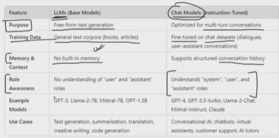

# Types of Models

- Language Models ( Closed Source(OpenAi , claude etc) and Open Source (hf)) : Takes input as text and generates text
    - LLMs - General purpose ( text gen, code generation) (**They have become Old**)
   ## - ChatModels ( VVimp) - Converational Task

- Embedding Models (Closed and Open Source)
    - Creates an embedding for the given text
    - Used for semantic search

